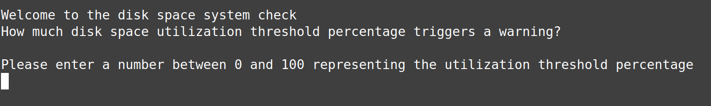
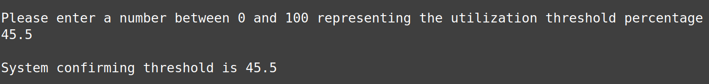
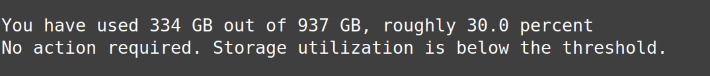
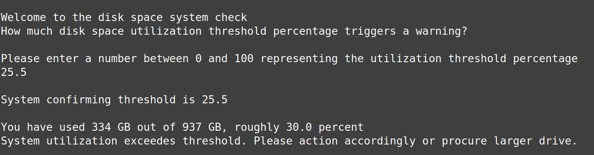

# Bash Script For Storage Utilization

## Program Overview
This program is designed to demonstrate the following skills:
* Utilize bash's bc to perform floating point division
* Take user input and store the variable within a bash script
* If statment
* Utilize sed or awk to perform manipulation

## Program Purpose
The purpose of this program is to determine if your disk's memory utilization is over a certain threshold. The script was tested on Linux Mint using an NVME drive.

## Example Execution

### Part 1: Startup

### Part 2: User Input and System Check

### Part 3: Disk Utilization Below Threshold

### Part 4: Disk Utilization Above Threshold

  
